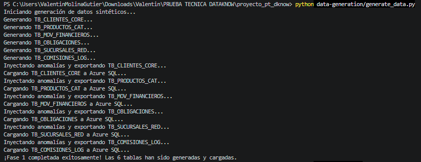
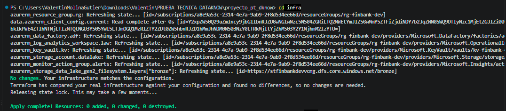
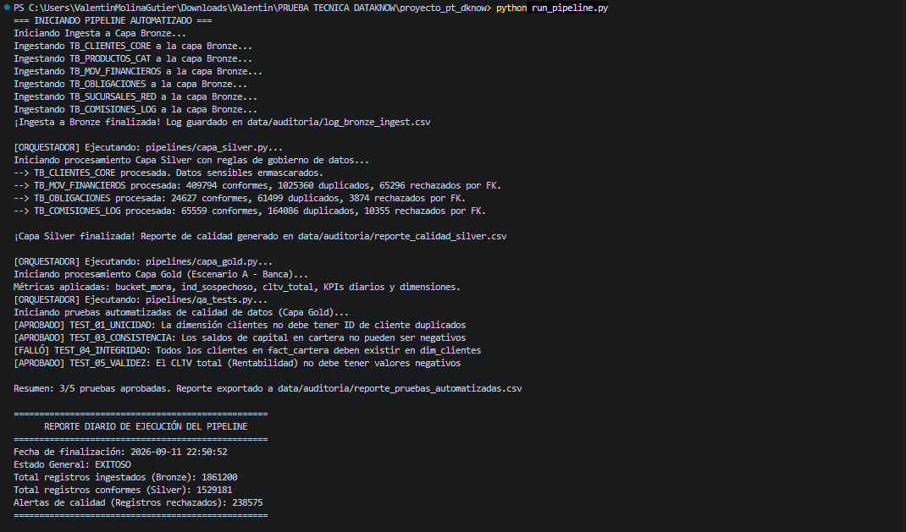
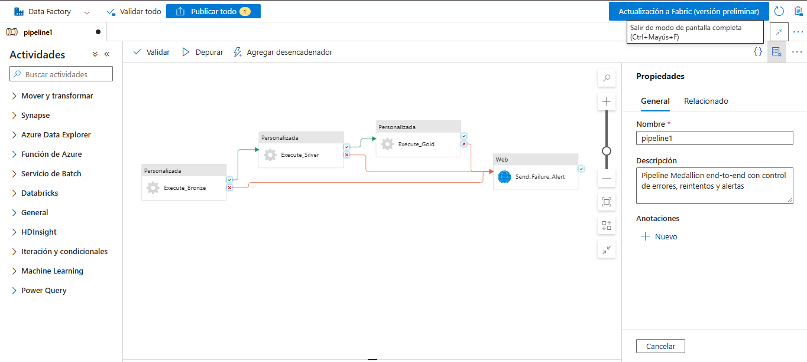
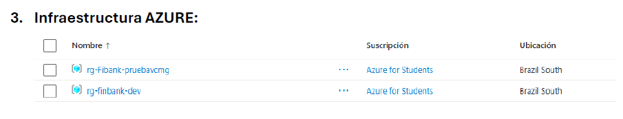
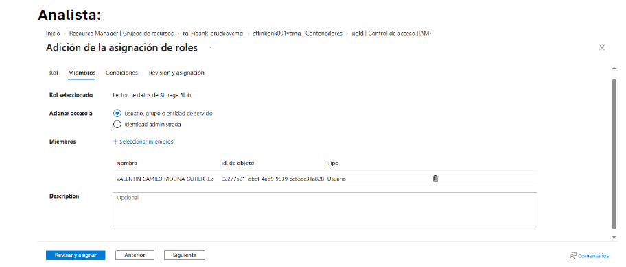
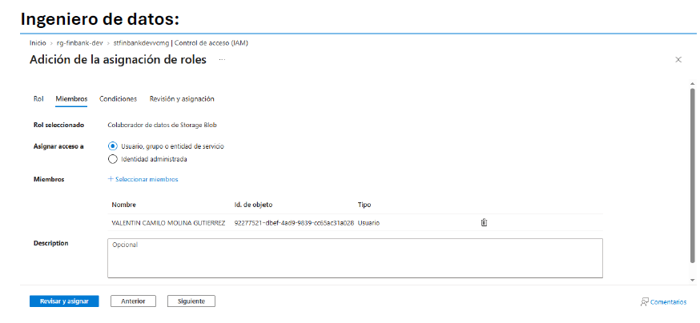
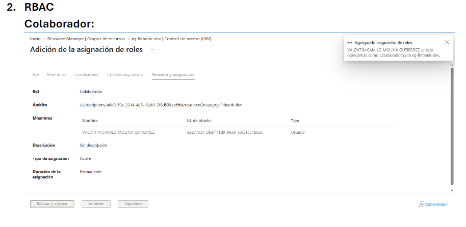

# # FINBANK S.A proyect DataEngineer - DataKnow

**Desarrollado por:** Valentín Molina Gutierrez 
**Perfil Institucional:** Estudiante de Tecnología ITM | Candidato a Data Engineer  
**Fecha de Entrega:** Septiembre 2026

---

## 1. Definición del Proyecto y Justificación Técnica

### Sector Seleccionado: Escenario A - Banca y Servicios Financieros
**Justificación:** El sector financiero presenta pruebas complejas en majoe de datos, encriptación, identificación e integración. Elegí este escenario porque me permitió desenvolverme y aprender mas sobre PII mediante enmascaramiento criptográfico (SHA-256), cruces complejos de reglas de negocio para calcular mora y CLTV, y la detección de anomalías transaccionales (prevención de fraude) requeridas en entornos regulatorios críticos.

### Plataforma Cloud Seleccionada: Microsoft Azure
**Justificación:** Azure ofrece el ecosistema integrado más robusto para arquitecturas empresariales seguras, también porque es un entorno al cual estoy acostumbrado a trabajar con base en mis funciones diarias. Su sinergia nativa entre Azure Data Lake Storage Gen2 (arquitectura jerárquica ideal para Medallón), Azure SQL, Azure Data Factory para orquestación, y Azure Key Vault para la inyección de secretos, garantiza un entorno de nivel de producción que cumple con los más altos estándares de infraestructura como código (IaC) e IAM (RBAC).

---

## 2. Arquitectura de la Solución (Medallón)

El pipeline de datos sigue el patrón Medallón (Multihop), garantizando escalabilidad, inmutabilidad y calidad progresiva de los datos:

*   **Origen (Azure SQL / Generador):** 6 tablas transaccionales generadas sintéticamente con inyección controlada de anomalías (nulos, fechas atípicas, duplicados).
*   **Capa Bronze (Raw):** Ingesta inmutable en formato Parquet. Incluye metadatos de auditoría (`_ingestion_timestamp`, `_source_system`, `_batch_id`) y particionamiento físico (`year/month/day`).
*   **Capa Silver (Conformada):** Limpieza, deduplicación, validación de integridad referencial (con desviación a tabla de errores) y enmascaramiento hash de datos sensibles (PII).
*   **Capa Gold (Analítica):** Modelo dimensional (Star Schema) implementando lógicas de negocio de negocio: buckets de mora, flag de transacciones sospechosas y cálculo consolidado del Customer Lifetime Value (CLTV).

* "Nota de Arquitectura: Siguiendo el principio de separación de responsabilidades (SoC), la base de datos transaccional de origen se mantiene aislada en un Resource Group independiente, simulando la extracción desde un sistema externo corporativo hacia el entorno analítico gestionado por Terraform."

---

## 3. Estructura del Repositorio

\`\`\`text
proyecto_pt_dknow/
├── data-generation/       # Script generador (semilla 42) y config.yaml
├── docs/                  # Catálogo de datos, roles RBAC y evidencias
├── infra/                 # Código Terraform (main, variables, providers)
├── orchestration/         # Definición de triggers y dependencias (ADF JSON)
├── pipelines/             # Scripts Python ETL (Bronze, Silver, Gold y QA)
├── run_pipeline.py        # Orquestador local con validación de volumen
├── CHANGELOG.md           # Historial formal de cambios y versionado
└── README.md              # Documentación principal
\`\`\`

---

## 4. Guía de Despliegue y Ejecución

### Manual de Ejecución Paso a Paso - FinBank Medallion Pipeline

Esta guía detalla el proceso para que cualquier ingeniero o evaluador pueda desplegar la infraestructura, instalar dependencias y ejecutar el pipeline Medallion localmente o en Azure desde cero.

#### 4.1. Pre-requisitos del Sistema
Asegúrese de tener instalado el siguiente software antes de comenzar:
* **Python 3.10+** (Añadido al PATH).
* **Terraform CLI** (v1.0.0 o superior).
* **Azure CLI** (`az`).
* **ODBC Driver 18 for SQL Server** (Requerido por la librería `pyodbc` para la conexión a Azure SQL).

#### 4.2. Configuración del Entorno Local

1. Clone el repositorio e ingrese al directorio del proyecto:
   ```bash
   git clone <url-del-repositorio>
   cd proyecto_pt_dknow
   ```

2. Cree y active un entorno virtual de Python para aislar las dependencias:
   ```bash
   python -m venv venv
   
   # Activar en Windows:
   venv\Scripts\activate
   
   # Activar en Mac/Linux:
   source venv/bin/activate
   ```

3. Instale las librerías necesarias ejecutando:
   ```bash
   pip install pandas numpy pyarrow faker sqlalchemy pyodbc python-dotenv pyyaml
   ```

4. Cree un archivo llamado `.env` en la raíz del proyecto y configure las credenciales de su base de datos origen (Azure SQL):
   ```env
   DB_SERVER=tu-servidor.database.windows.net
   DB_DATABASE=tu-base-de-datos
   DB_USER=tu-usuario
   DB_PASSWORD=tu-contraseña
   ```

#### 4.3. Autenticación y Despliegue de Infraestructura (Terraform)

La infraestructura se gestiona mediante código (IaC) e incluye un backend remoto para el estado de Terraform.

1. Inicie sesión en su cuenta de Azure y siga las instrucciones en el navegador:
   ```bash
   az login
   ```

2. Navegue a la carpeta de infraestructura e inicialice Terraform (descargará los providers de Azure):
   ```bash
   cd infra
   terraform init
   ```

3. Cree un espacio de trabajo para el entorno de desarrollo y despliegue los recursos (Storage Account, Key Vault, Data Factory, Log Analytics y Action Group):
   ```bash
   terraform workspace new dev
   terraform apply -var="environment=dev" -var="location=brazilsouth" -auto-approve
   ```

#### 4.4. Ejecución del Pipeline de Datos (ETL)

Regrese a la raíz del proyecto para ejecutar el ciclo de vida de los datos.
   ```bash
   cd ..
   ```

1. **Generar e inyectar datos sintéticos:**
   ```bash
   python data-generation/generate_data.py
   ```
   *Resultado:* Se inyectan las 6 tablas con anomalías controladas (nulos, duplicados) directamente en Azure SQL y se exportan réplicas en CSV/Parquet a la carpeta `/data_output`.

2. **Ejecutar el Orquestador Local (Arquitectura Medallion):**
   ```bash
   python run_pipeline.py
   ```
   *Resultado del orquestador:* 
   * Ejecuta la extracción hacia la **Capa Bronze**.
   * Limpia, cruza llaves y enmascara PII hacia la **Capa Silver**.
   * Calcula variables de negocio (mora, CLTV, fraude) en la **Capa Gold**.
   * Ejecuta **5 pruebas automatizadas de calidad (QA)** y detiene el proceso si detecta inconsistencias.
   * Dispara una alerta de consola si la variación de volumen supera el 30%.

#### 4.5. Integración y Orquestación en Azure Data Factory (ADF)

Para desplegar la orquestación programada en la nube:

1. Abra su recurso de Azure Data Factory recién creado en el portal de Azure y haga clic en **Launch studio**.
2. En el panel izquierdo, navegue a la pestaña **Author** (ícono de lápiz).
3. En la sección *Pipelines*, haga clic en los tres puntos y seleccione **New pipeline**.
4. Haga clic en el botón de `{}` (Código) en la esquina superior derecha del lienzo.
5. Copie y pegue el contenido exacto del archivo `orchestration/adf_pipeline.json` ubicado en este repositorio.
6. Haga clic en **Apply**. 

El JSON configurará automáticamente:
* La ejecución secuencial de los scripts (Bronze -> Silver -> Gold).
* Las dependencias estrictas (`Succeeded`).
* Las políticas de 3 reintentos con intervalo de 30 segundos.
* El WebHook de alerta para reportar fallos (`Failed`).
* El Trigger de programación diaria a las 02:00 AM.

---

## 5. Gobierno de Datos, Seguridad y Calidad

*   **Protección PII:** Implementada en la capa Silver con `hashlib` (SHA-256) sobre documentos de identidad y nombres de clientes.
*   **Alertas Operativas:** El script orquestador y ADF incluyen detección automática de variación de volumen de ingesta (>30%), además de reportes diarios post-ejecución.
*   **Pruebas de Calidad (QA):** Verificaciones automatizadas (`qa_tests.py`) que auditan unicidad, completitud, y consistencia matemática de los KPIs en la capa Gold.
*   **Documentación:** Catálogo de datos con linaje detallado y modelo de roles (RBAC) centralizados en la carpeta `/docs`.

## 6. Imágenes de evidencia.








